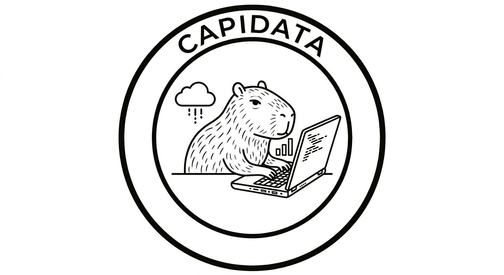

# O que é a CAPIDATA?



A CAPIDATA é uma comunidade open-source e sem fins lucrativos que constrói o ecossistema Capiba: um protocolo anti-colonial de soberania, inteligência e governança popular de dados.

O nome vem do Rio Capibaribe, que nasce no Agreste e banha Pernambuco, e de Capiba, o mestre do frevo que musicou a alma nordestina. A metáfora central é o tear: cada contribuição é um fio que fortalece o tecido final. Não por acaso. O polo têxtil do Agreste pernambucano (Jataúba, Santa Cruz do Capibaribe, Toritama) é um dos maiores do Brasil. Lá, tecer é ato de trabalho, arte transmitida por gerações e identidade cultural.

Construída no Nordeste. Para o Brasil. Para a América Latina. Para o Sul Global.

---

## O problema

O povo brasileiro gera dados o tempo todo. Cada compra no MEI. Cada consulta no SUS. Cada votação na assembleia da cooperativa. Cada ocupação registrada. Cada colheita documentada. Cada filho matriculado.

Esses dados são capturados por plataformas estrangeiras, processados fora do território, vendidos de volta como "serviço", e usados para aprofundar a dependência de quem os gerou.

O capitalismo nos controla nos melancolizando: privatiza o sofrimento, transforma a dor coletiva em depressão individual. A CAPIDATA é o espaço onde esse sofrimento ganha nome coletivo, causa identificada e ação que emerge da compreensão.

---

## O que o Capiba faz

O Capiba inverte a lógica extrativista. É para a tecnologia o que uma constituição é para uma nação: o pacto que define o que não pode ser violado e o que pode ser construído sobre ele.

```
O dado nasce no território.
Permanece no território.
Gera inteligência para quem o produziu.
É governado por quem tem mais a perder com ele.
```

O ecossistema vai da infraestrutura ao aplicativo final:

| Camada | O que é |
|--------|---------|
| **Protocolo Core** | Identidade soberana, commons, governança, federação |
| **IaaS** | Nós territoriais, rede mesh, armazenamento federado |
| **PaaS** | APIs, ML popular, orquestração, SDKs |
| **SaaS** | Feira solidária, saúde, educação, crédito, cultura |
| **SuperApps** | Capiba MEI, Associação, Cooperativa, Movimento, Território |

Não é utopia. É protocolo.

---

## A ética que nos move

O Capiba não é só infraestrutura técnica. É infraestrutura ética. Cinco ideias orientam tudo que construímos:

**Conatus.** Cada pessoa, cada comunidade, cada território se esforça para perseverar no próprio ser. A tecnologia ou amplia essa potência ou a diminui. Não existe meio-termo.

**O desejo é produção, não falta.** A CAPIDATA não existe para preencher uma carência. Existe para produzir realidade. O que as comunidades já praticam (o mutirão, a cozinha comunitária, a moeda social, o coco de roda) são expressões de potência que a teoria não precisa inventar, apenas tornar legível.

**O poder está em toda parte, inclusive aqui dentro.** Este projeto não cria um espaço livre de poder. Cria um espaço que assume a responsabilidade de tornar seus mecanismos de poder legíveis e contestáveis.

**Uma paixão compreendida é o começo de uma ação.** Compreender a causa do afeto é o primeiro ato político. É por isso que o Capiba exige explicabilidade de toda IA, transparência de todo processo, e legibilidade de toda decisão.

**Condições, não programa.** A transformação não é decreto que se adota. São condições de possibilidade que se constroem deliberadamente.

A fundamentação completa está no ensaio *Brasil e A Ética do Desejo* (Silvano Neto, 2026).

---

## Nossos princípios

São oito. Chamamos de cláusulas pétreas. Nenhuma votação, por maior que seja, pode removê-los. Podem ser aprofundados. Nunca esvaziados.

1. **Soberania**: nenhum dado sai do território sem consentimento explícito
2. **Anti-colonial**: português primeiro, sempre. A tensão entre contrários é potência, não defeito
3. **Assimetria como dado**: quem tem mais a perder decide mais sobre o que perde
4. **Ilegibilidade estratégica**: legibilidade serve ao povo, não ao extrator
5. **Conatus coletivo**: a tecnologia amplia a potência humana, nunca a substitui
6. **Commons, não mercadoria**: o código é livre; os dados das comunidades, soberanos
7. **Prática, não discurso**: se o usuário não entende, a ferramenta falhou
8. **Autocorreção permanente**: a CAPIDATA aceita ser transformada pelo confronto com quem vive o que ela teoriza

---

## O que não somos

- Não somos startup social
- Não somos ONG que "empodera comunidades"
- Não somos plataforma com modelo de negócio disfarçado de impacto
- Não somos tecnologia neutra. Somos tecnologia com ética embutida
- Não somos projeto acadêmico sem aplicação real
- Não somos espaço livre de contradição. Somos espaço que reconhece a contradição e a trabalha

---

## Quem pode participar

Qualquer pessoa. De qualquer área. De qualquer lugar.

O tear está armado para muitas mãos, e não só as que escrevem código. Tecnologia, direito, ciência, comunicação, design, economia solidária, educação popular, cultura, arte. Todas as áreas têm papel estrutural no ecossistema, não periférico.

A CAPIDATA tem um olhar especial para MEIs, associações e cooperativas: quem mais precisa de dados de qualidade, mas raramente tem acesso a soluções robustas, acessíveis e que respeitem sua soberania.

---

## O momento atual

Estamos no momento zero. A primeira assembleia será convocada quando tivermos pelo menos 5 pessoas apresentadas nas Discussions. Se você chegou até aqui, já sabe o suficiente para entrar.

```
Pacto Fundante:        v0.2
Licença:               Ética Capiba v0.2
Membros Plenos:        1 (Silvano Neto — fundador)
Brigadas Técnicas:     0
Próximo marco:         5 pessoas nas Discussions → primeira assembleia
```

---

## Como participar

O código, a governança, as decisões e a documentação vivem no GitHub:

**[github.com/capidata](https://github.com/capidata)**

Caminhos de entrada:

- **Leia as issues abertas**: cada uma é uma história de contribuição com sujeito real e problema concreto
- **Se apresente nas Discussions**: é o gesto fundante
- **Proponha uma ideia**: abra uma Discussion em Ideias
- **Relate um problema real de território**: sua experiência tem peso político especial
- **Corrija ou melhore documentação**: cada palavra em português importa

Toda contribuição começa com uma conversa.

---

> *"A teoria não precisa inventar o que já existe;*
> *precisa tornar legível o que a experiência já pratica."*

---

*Construído em Pernambuco. 2026.*
